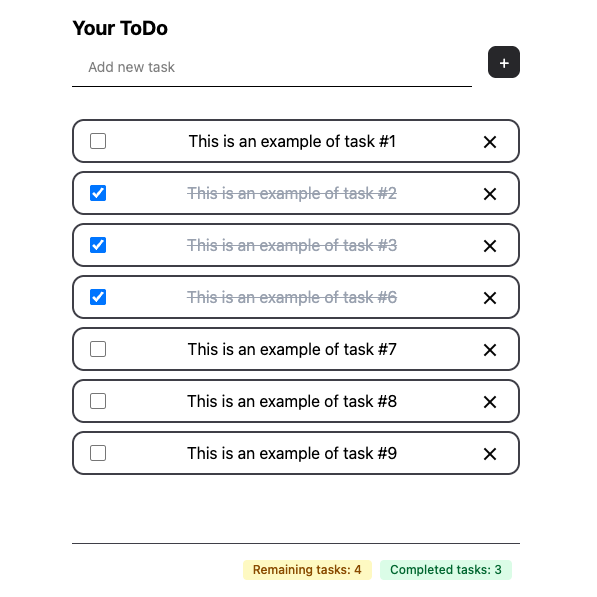

# 📝 Minimal ToDo App
Una aplicación de tareas simple, limpia y minimalista construida con **React**. Ideal para practicar conceptos modernos como `useReducer`, persistencia con `localStorage` y scroll automático al último elemento.

Inspirada en un diseño de [Mihai Dolganiuc en Dribbble](https://dribbble.com/shots/24425951-Clean-Minimal-Todo-List-Design), con ligeros ajustes personales.



## 🚀 Demo
👉 [Ver aplicación en Vercel](https://task-app-localstorage.vercel.app/) 

---

## ✨ Funcionalidades

- ✅ Agregar nuevas tareas
- ✏️ Editar tareas existentes
- ✔️ Marcar tareas como completadas
- 🗑️ Eliminar tareas (soft delete)
- 💾 Persistencia automática en `localStorage`
- 🔽 Scroll automático a la última tarea añadida
- 🧼 UI minimalista y responsive

---

## 🛠️ Tecnologías utilizadas

- [React](https://reactjs.org/)
- [Tailwind CSS](https://tailwindcss.com/)
- [Vite](https://vitejs.dev/) para el build
- [Vercel](https://vercel.com/) para el deployment

---

## 📦 Instalación local

```bash
git clone https://github.com/ramiromtz/task-app-localstorage.git
cd task-app-localstorage
npm install
npm run dev
```

# 🖌️ Créditos del diseño
Diseño original por [Mihai Dolganiuc](https://dribbble.com/MihaiDolganiuc)
<br>
➡️ [Clean Minimal ToDo List UI – Dribbble](https://dribbble.com/shots/24425951-Clean-Minimal-Todo-List-Design)